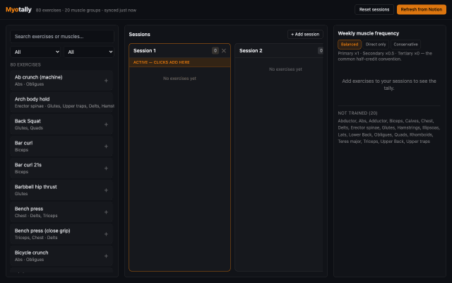

# Myotally

See exactly how often each muscle group gets trained — before you even start your workout.

**▶ Live app: [myotally.netlify.app](https://myotally.netlify.app/)**



## What is this?

If you plan your training in Notion — tagging every exercise with which muscles it works as primary, secondary, or tertiary — you already have the data to answer "am I actually training my whole body evenly?" The hard part is doing that math by hand every time you plan a new week.

Myotally connects to your Notion exercise library, lets you quickly build out your training sessions, and instantly shows you how many times per week each muscle group is being trained — weighted by how directly each exercise works it.

## How it works

1. **Connect your Notion library.** Myotally reads your existing Exercises and Muscle Groups databases — no need to re-enter anything.
2. **Build your sessions.** Search your exercise library and add exercises to whichever session you're planning, then set how many sets you're doing for each.
3. **Watch your weekly tally update live.** As you build, a running tally shows how many times each muscle group is being hit that week — and which ones you haven't touched at all.
4. **Choose how "hits" are counted.** There's no universally agreed way to score secondary or tertiary muscle involvement, so you can switch between a few different weighting philosophies and see how your program looks under each one.

## Features

- Search and filter your full exercise library by movement pattern or mechanics
- Build as many sessions as you like, side by side
- Track sets per exercise, per session
- A live weekly frequency tally per muscle group, with a breakdown of primary vs. secondary contribution
- Multiple weighting philosophies (Balanced, Direct-only, Conservative) so you can decide how much credit secondary/tertiary involvement gets
- Everything you build stays in your browser — nothing is ever written back to Notion

## Getting started

Myotally runs on your own machine and connects to your own Notion workspace — no account or sign-up required.

1. **Create a Notion integration** at [notion.so/my-integrations](https://www.notion.so/my-integrations) and copy its secret key.
2. **Share your two databases** (Exercises and Muscle Groups) with that integration, from each database's "Connections" menu in Notion.
3. **Add your credentials.** Copy `.env.local.example` to `.env.local` and fill in your integration's secret key and your two database IDs (found in each database's URL).
4. **Run it:**
   ```bash
   npm install
   npm run dev
   ```
5. Open the app in your browser and start building sessions.

## A note on privacy

Myotally only ever *reads* from Notion — it never creates, edits, or deletes anything in your workspace. Your sessions live entirely in your browser's local storage, so they stay private to your device and are never sent anywhere else.
